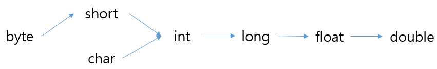
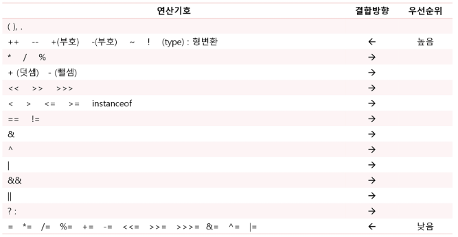

# 자바 기본

- 변수
    
    자료를 저장하기 위한 메모리 공간
    
    값(value)을 할당 후 사용
    
    타입에 따라 크기가 다르다
    
    - 기본형
        
        ```java
        int a = 10;
        ```
        
        - 크기
            - 논리형
                
                boolaen
                
            - 정수형
                
                
                | byte | 8bit |
                | --- | --- |
                | short | 16bit |
                | int | 32bit |
                | long | 64bit |
            - 실수형
                
                
                | float | 32bit |
                | --- | --- |
                | double | 64bit |
            - 문자형
                
                
                | char | 16bit |
                | --- | --- |
        - 형변환
            - 묵시적 형변환
            
            
            
            - 명시적 형변환
            
            ```java
            double d = 100.5;
            int a = (int)d;
            ```
            
    - 참조형(reference type)
        
        ```java
        int a;
        a = 10;
        ```
        
- 연산자
    
    
    
- 조건문
    
    ```java
    if(조건)
    else if(조건)
    else
    ```
    
    ```java
    switch() {
    	case :
    	default:
    }
    ```
    
- 반복문
    - for문
    
    ```java
    for(int i=0; i<10; i++) {
    	...
    	break;
    }
    for(int i: arr){
    	break;
    }
    ```
    
    → 초기값, 조건식, 증감식 명확
    
    → 반복횟수 명확
    
    → index 증감 활용
    
    - while문
    
    ```java
    while(){
    	break;
    }
    ```
    
    → 반복횟수 불명확
    
    → break, continue 활용